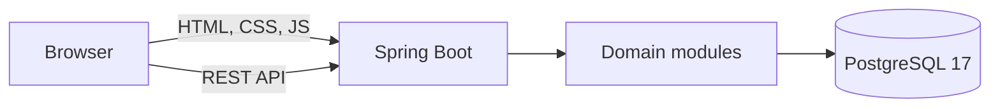

# Architecture

JobTrace Java is a modular monolith delivered as one executable Spring Boot JAR. React and TypeScript compile to static assets that are embedded during the production build.



## Dependency direction

```text
web -> application -> domain
                  ^
                  |
          infrastructure
```

- `domain` contains stable business language and rules.
- `application` coordinates use cases and defines infrastructure ports.
- `infrastructure` implements persistence and external integrations.
- `web` maps authenticated HTTP requests to application use cases.

Cross-module calls use explicit application contracts. Database access remains server-side and every owner-scoped query carries the authenticated actor identifier.

## Runtime modes

During development, Vite and Spring Boot run separately. Vite proxies `/api` to port 8080. In production, Maven builds the frontend and embeds it in the JAR; only Java and PostgreSQL run on the host.

## Database ownership

The existing PostgreSQL schema remains authoritative. Flyway is present for future ownership but disabled until a baseline is approved. jOOQ and Spring JDBC preserve existing functions, custom types, JSONB, and explicit transaction semantics.

## Security boundary

The initial health routes are anonymous. Future routes default to authenticated. The migration must not trust identity headers from public traffic. Better Auth remains the identity owner until a signed internal bridge and eventual Spring Security migration are separately specified.
